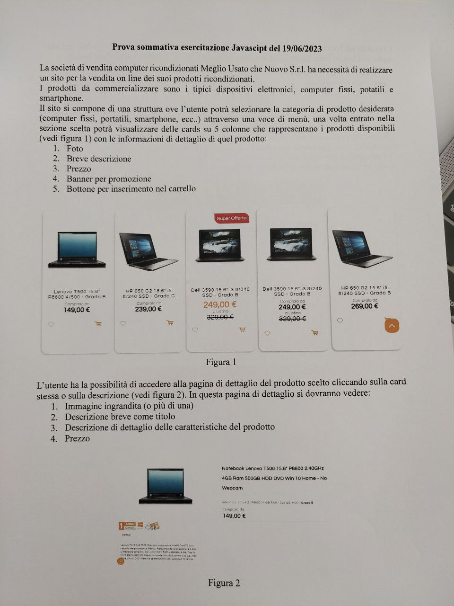
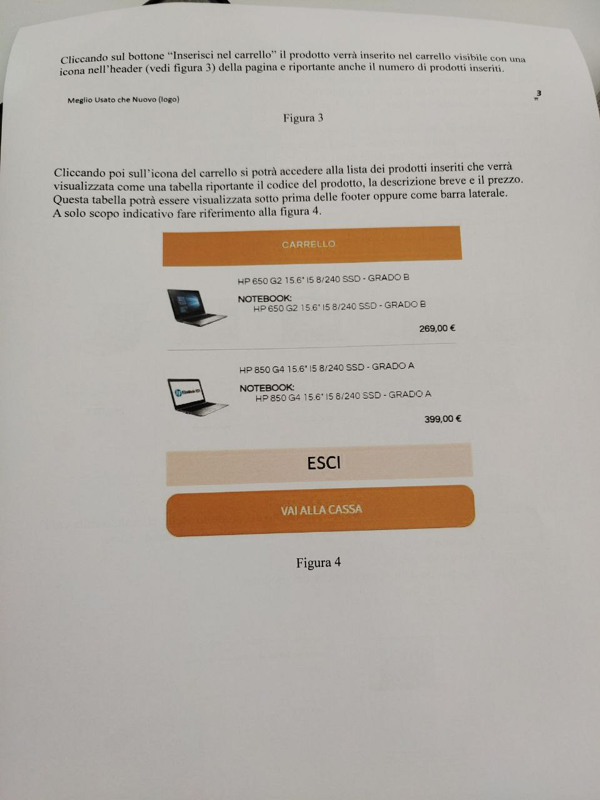

# Esercitazione React

consegna:

## SPIEGONE SOLUZIONE
1) creare pag html con header, menù, main, footer. Si possono creare come html in una pag o anche in javascript come funzioni che ritornano elementi HTML.
>in header serve il logo carrello con un numero che mostra gli oggetti inseriti

2) Selezione tipologia prodotto con select option o meccanismo simile

3) Nel main ci sono le card che mostrano i prodotti in funzione della categoria scelta. Selezionata la categoria bisognerà chiamare la funzione che genera le card, tale funzione deve avere come parametri il nome del prodotto e le descrizioni. Per posizionarle nella pagina possiamo creare un elemento rows che raggruppa un tot di cards (5 per riga) e poi si vanno a inserire gli elementi rows nella pagina

4) Footer opzionale nulla di rilevante per il funzionamento della pagina

- Menù: gestione eventi per selezionare il tipo prodotto

- Card: 
> Elememto/Componenete che permette di visualizzare il prodotto. Il componente può essere anche una funzione js
    indispensabile avere un'icona carrello che mette il prodotto nel carrello e un evento sul click della descrizione (o immagine)
- Dettaglio:
    >una pagina nuova o una fz che riscrive parte della pagina per mostrare il dettaglio

- Carrello:
> lista di prodotti inseriti 

### Dati:

Strutturati come array di oggetti, usando i [filtri dell'array di js](https://developer.mozilla.org/en-US/docs/Web/JavaScript/Reference/Global_Objects/Array/filter), si possono selezionare le categorie di prodotti per recuperare la parte di array che interessa mostrare.

I dati del carrello saranno rappresentati inizialmente come array vuoto, ogni volta che si clicca per mettere in carrello un prodotto si fa un push()

## Funzionalità Opzionali

Svuota carrello 